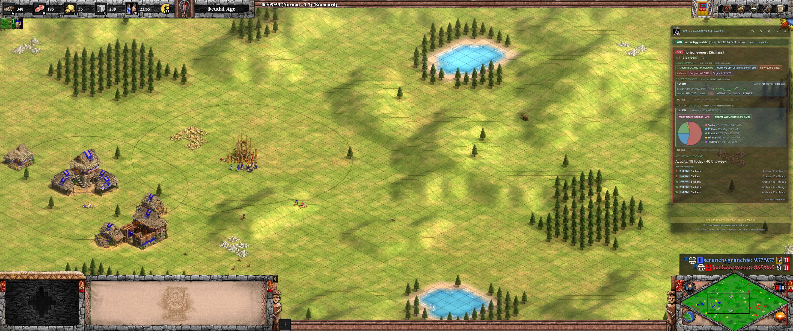
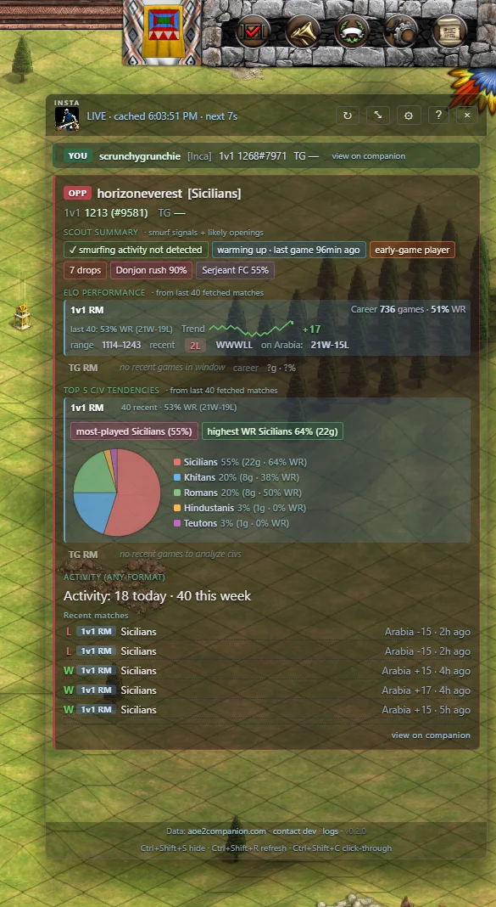
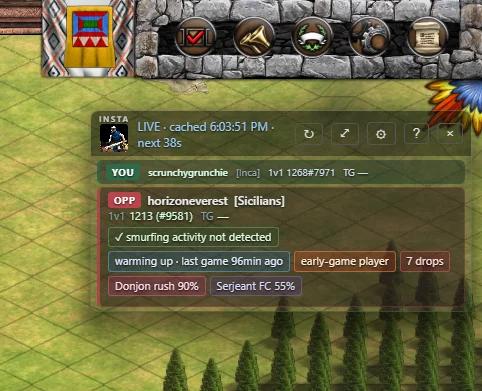

# AoE2 Insta Scout

[](https://github.com/aliencoded/aoe2-stats-overlay-rust/releases/latest)
[](LICENSE)

Instant in-game opponent scouting for **Age of Empires II: Definitive Edition**. Shows your opponent's rating, civ tendencies, likely openings, smurf probability, and session state — right on top of the game, while you play.



Project page: https://www.thinkingslightly.com/aoe2-opponent-stats-ui-overlay/

## Download

- **[Portable .exe (latest)](https://github.com/aliencoded/aoe2-stats-overlay-rust/releases/latest/download/aoe2-insta-scout.exe)** — ~6 MB, no install, just run
- [All releases + installers](https://github.com/aliencoded/aoe2-stats-overlay-rust/releases) — MSI / NSIS / older versions

See [CHANGELOG.md](CHANGELOG.md) for what's new. **v0.2.0** adds the **Scout summary** section per opponent: smurf probability, session state, civ-typical opening predictions with data-adjusted confidence, drops badge, and an early/mid/late-game playstyle classification. Civ tendencies are now visualized as a pie chart. Window dimensions, logging, and the title bar got polish too.

Windows 10/11. Steam version of AoE2DE. SmartScreen will warn — click **More info → Run anyway** (not signed; codesign certs are ~$200/yr).

## Screenshots

| Full card | Scout summary detail |
|---|---|
|  |  |

## What you get per opponent

Each card splits into four honest sections, all from companion's public data:

**Scout summary** (NEW in v0.2.0):
- **Smurf probability** (0–95%) from ELO trend, games count, win streak, recent winrate. Hover for contributing signals.
- **Session state**: fresh session, warming up, deep-grind detection — based on match timing patterns
- **Playstyle tag**: early/mid/late-game player, inferred from most-played civ
- **Likely openings** by civ pick (Tower rush, Donjon rush, Fast scouts, Drush FC, etc.) with confidence % adjusted by their familiarity with the civ, civ winrate, and average game length
- **Drops badge** — rage-quit signal from companion

**ELO performance** (per format — 1v1 / TG separately):
- Career games, winrate, streak — from companion's per-format rank, no mixing
- Inline sparkline trend chart over the analysis window + net ELO change
- Rating range, last 5 W/L sequence with colored streak badge
- Record on the **current match's map** within that format

**Top 5 civ tendencies** (per format, NEW pie chart view):
- **Pie chart** of top 5 civs, sized by play share, with single-column legend showing share %, games, and per-civ winrate
- **Most-played** vs **highest WR** civ called out separately (they're different signals)
- **⚠ Mirror civ alert** if their most-played in this format matches the civ you picked this match

**Activity** (any format):
- Games today / this week — binge or warmed-up?
- Verbose list of their last 5 matches: format tag (1v1/TG), civ, map, ELO change, time ago

Plus your own stats in a compact self bar above the opponents and a faded "last match" view after the game ends.

## How it works

1. Reads your SteamID64 from the Windows registry (`HKCU\Software\Valve\Steam\ActiveProcess`).
2. Races companion's `/api/nightbot/match` (fast, ~10–15s) and `/api/matches` (canonical, ~30–60s). Whichever surfaces first wins.
3. Per player: parallel fetch of 1v1 rank, TG rank, and 40 most-recent matches. Uses the canonical `profile_id` directly (avoiding companion's fuzzy name search that used to return the wrong "Berni").
4. Client-side groups the 40 matches by leaderboard and renders per-format breakdowns.
5. Adaptive polling: **90s idle**, 45s live, 60s post-match. "Check now" button short-circuits the idle wait.
6. In-app update banner polls GitHub releases on boot.

## Hotkeys & UI

- `Ctrl+Shift+S` — toggle full ↔ compact view
- `Ctrl+Shift+R` — force refresh, clear cache
- `Ctrl+Shift+C` — toggle click-through (lets clicks pass to the game)
- ⚙ gear icon — settings panel: pick which sections show in full vs compact
- Auto full ↔ compact mode switch when the game gains/loses focus
- Fixed window sizes — 520×900 full, 380×200 compact (drag-resize if needed)

## Comparison

| Tool | Auto-detect opp | Per-format split | Smurf detection | Opening prediction | Civ pie chart | In-game |
|---|---|---|---|---|---|---|
| aoe2companion (web/mobile) | ✗ manual lookup | partial | ✗ | ✗ | ✗ | ✗ browser/phone |
| aoe2insights.com | ✗ manual lookup | ✗ | ✗ | ✗ | ✗ | ✗ |
| Discord !opp bots | ✗ chat command | ✗ | ✗ | ✗ | ✗ | ✗ |
| CaptureAge | spectator only | ✗ | ✗ | ✗ | ✗ | spec client |
| OBS browser overlays | partial | ✗ | ✗ | ✗ | ✗ | viewer only |
| **Insta Scout** | ✓ | ✓ | ✓ | ✓ | ✓ | ✓ |

Same raw data as aoe2companion (their public API). Difference: zero clicks per match, per-format synthesis, signals nobody else surfaces.

## Data source

[aoe2companion.com](https://www.aoe2companion.com/) — same data their mobile app and site use. Polite User-Agent identifies the app, links back here so their maintainer can reach me. No analytics, no error reporting, no account, no Microsoft/Xbox calls.

## Tech

Tauri 2 + Rust. Vanilla HTML/CSS/JS frontend, no build step. Native Win32 calls (`GetForegroundWindow`, registry read for SteamID) instead of shelling out. ~6 MB portable build vs ~80 MB Electron prototype.

## Build from source

Requires:
- Rust MSVC toolchain (`rustup default stable-x86_64-pc-windows-msvc`)
- VS 2022 Build Tools + VCTools workload + Windows 11 SDK
- Node 18+

```
git clone https://github.com/aliencoded/aoe2-stats-overlay-rust
cd aoe2-stats-overlay-rust
npm install
npm run tauri dev      # dev, hot-reload
npm run tauri build    # release exe + installers
```

Plain PowerShell lacks `link.exe` in PATH. Run from "x64 Native Tools Command Prompt for VS 2022", or `call vcvars64.bat` first.

## License

MIT — see [LICENSE](LICENSE).

## Disclaimer

Not affiliated with Microsoft, Xbox Game Studios, World's Edge, or Forgotten Empires. Age of Empires II: Definitive Edition is a trademark of its respective owners. Use at your own risk.
