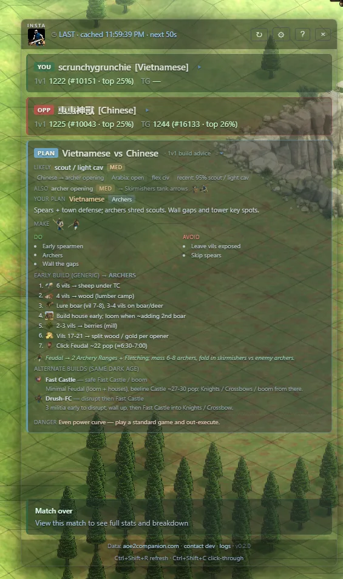
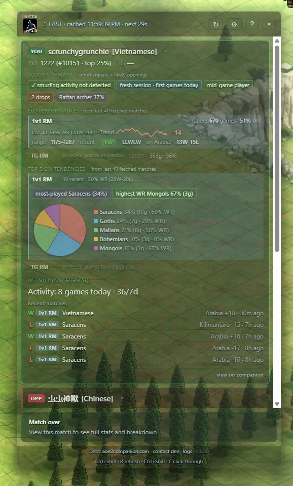
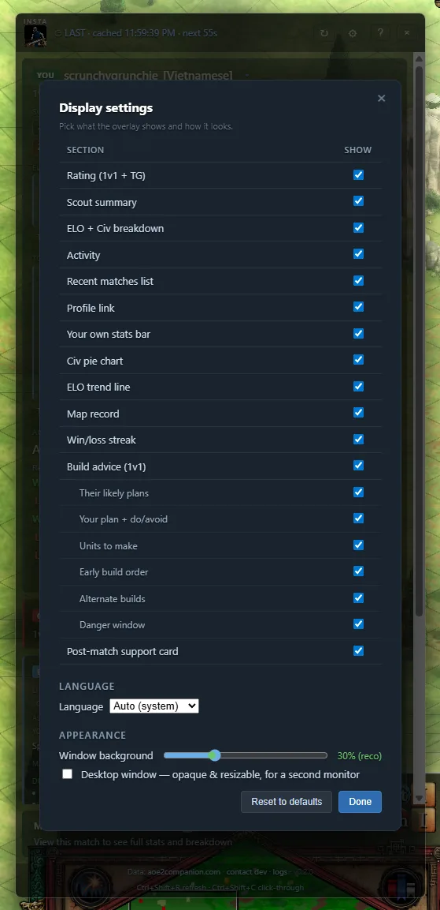

# AoE2 Insta Scout

Instant in-game opponent scouting for **Age of Empires II: Definitive Edition**. Shows your opponent's rating, civ tendencies, likely openings, smurf probability, and session state. Right on top of the game while you play.

Project page: https://www.thinkingslightly.com/aoe2-opponent-stats-ui-overlay/

## Download

- **[Portable .exe (latest)](https://github.com/aliencoded/aoe2-stats-overlay-rust/releases/latest/download/aoe2-insta-scout.exe)** — ~6 MB, no install, just run
- [All releases + installers](https://github.com/aliencoded/aoe2-stats-overlay-rust/releases) — MSI / NSIS / older versions

See [CHANGELOG.md](CHANGELOG.md) for what's new.

Windows 10/11. Steam version of AoE2DE. SmartScreen will warn — click **More info → Run anyway** (not signed).

## Screenshots

| Scout summary | Display settings |
|---|---|
|  |  |

## What you get per opponent

**Scout summary**
- **Smurf probability** (0–95%). Hover for the signals behind it.
- **Session state**: fresh session, warming up, deep grind
- **Playstyle**: early / mid / late-game player
- **Likely openings** by their civ pick (Tower rush, Donjon rush, Fast scouts, Drush FC, etc.) with confidence %
- **Drops badge**: rage-quit signal

**ELO performance** (per format — 1v1 / TG)
- Career games, winrate, streak
- ELO trend chart + net change
- Rating range, last 5 W/L sequence
- Record on the current match's map

**Top 5 civ tendencies** (per format)
- Pie chart of top 5 civs with share %, games, winrate
- Most-played vs highest-WR civ called out separately
- ⚠ Mirror civ alert if their main matches your pick

**Activity**
- Games today / this week
- Their last 5 matches: civ, map, ELO change, time ago

**Build advice — PLAN card (1v1)**
- Predicts their likely opening from civ + map + recent picks, confidence-tagged
- Counter direction + your recommended opener and a generic dark-age → feudal build order
- Key units to make, do's / don'ts, and the danger window

Plus your own stats bar above the opponents and a faded "last match" view after the game ends.

## Hotkeys

- `Ctrl+Shift+R` — force refresh
- `Ctrl+Shift+C` — toggle click-through (clicks pass to the game)
- ⚙ gear icon — settings: pick which sections show, set background opacity, change language

Single always-on-top overlay. On a new match the opponent + plan cards open for 2 min (visible countdown), then the opponent card auto-collapses so the build order stays in focus. Click any card header to expand/collapse it.

## Languages

English, Español, Deutsch, Français, Italiano, Português (BR), Русский, Polski, 中文, 한국어. Pick yours in Settings.

## Comparison

| Tool | Auto-detect opp | Per-format split | Smurf detection | Opening prediction | Civ pie chart | In-game |
|---|---|---|---|---|---|---|
| aoe2companion (web/mobile) | ✗ manual lookup | partial | ✗ | ✗ | ✗ | ✗ browser/phone |
| aoe2insights.com | ✗ manual lookup | ✗ | ✗ | ✗ | ✗ | ✗ |
| Discord !opp bots | ✗ chat command | ✗ | ✗ | ✗ | ✗ | ✗ |
| CaptureAge | spectator only | ✗ | ✗ | ✗ | ✗ | spec client |
| OBS browser overlays | partial | ✗ | ✗ | ✗ | ✗ | viewer only |
| **Insta Scout** | ✓ | ✓ | ✓ | ✓ | ✓ | ✓ |

## Data source

All stats come from [aoe2companion.com](https://www.aoe2companion.com/).

## Privacy

Your Steam ID is read locally to find your current match; stats are fetched from aoe2companion. An **anonymous, opt-out usage ping** (a random per-install ID + app version only — never your Steam ID, profile, name, or match data) lets install counts be tracked; turn it off in **Settings → Appearance**. With it off, the app talks to GitHub directly for update checks. Full details in [SECURITY.md](SECURITY.md).

## Attribution

- **Stats API** — [aoe2companion.com](https://www.aoe2companion.com/) (maintained by Dennis Keil / denniske).
- **Build-order icons** — resource, unit, building and gaia icons from [denniske/aoe2companion](https://github.com/denniske/aoe2companion); age icons from [SiegeEngineers/aoe2techtree](https://github.com/SiegeEngineers/aoe2techtree).
- **Game assets** — Age of Empires II: Definitive Edition icons and civilization names are © Microsoft Corporation. This is an unofficial fan tool, not affiliated with or endorsed by Microsoft.
- **Build orders & strategy** — generic, community-standard openings and counter heuristics authored for this project; not copied from any specific guide.

## License

[MIT](LICENSE) (applies to this project's own code; bundled game icons remain © Microsoft.)

## Disclaimer

Not affiliated with Microsoft, Xbox Game Studios, World's Edge, or Forgotten Empires. Age of Empires II: Definitive Edition is a trademark of its respective owners. Use at your own risk.
